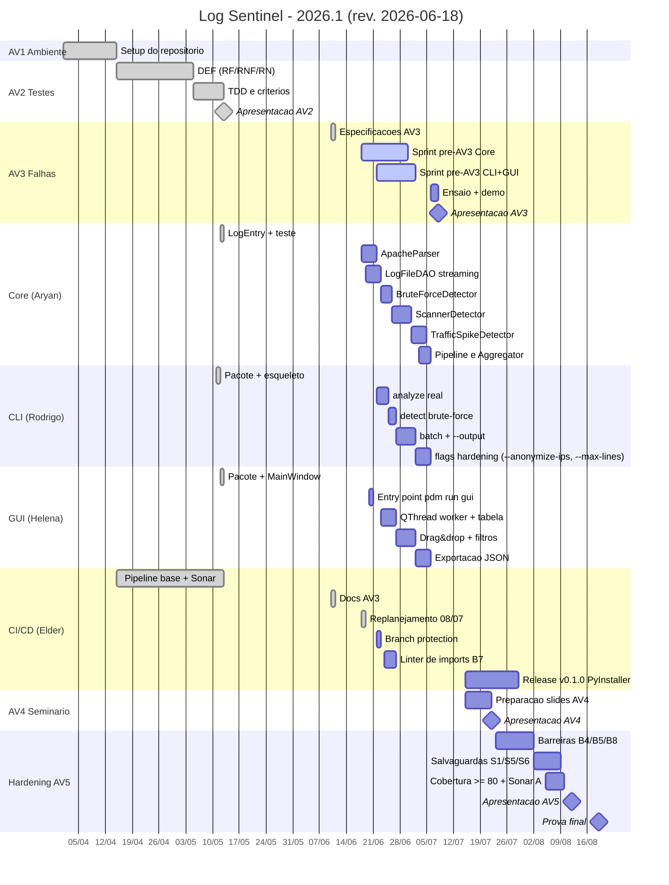

# Cronograma de Implementação — Log Sentinel 2026.1

Gráfico de Gantt com as cinco milestones do projeto, distribuídas entre abril e agosto de 2026. Datas alinhadas ao cronograma oficial da disciplina Engenharia de Software II.

> Última revisão: **2026-06-18** (após adiamento da AV3 pelo professor para **08/07/2026**). Mudanças principais:
> - AV2 fechada ✅.
> - AV3 adiada de 17/06 → **08/07/2026** (prazo interno: 06/07).
> - Sprint de recuperação original (11–14/06) **não foi cumprida** — sem commits novos entre 13/05 e 18/06.
> - Nova **Sprint pré-AV3** (18/06 → 05/07) reabre Core+CLI+GUI antes da apresentação.
> - Sprint 2 (CLI/GUI) parcialmente paralela à AV3 para garantir demonstração.
> - Acrescentado bloco "Hardening" pós-AV4 cobrindo barreiras/salvaguardas do [doc AV3-01](av3/01_BARREIRAS_SALVAGUARDAS.md).

## Marcos da disciplina

| AV | Tema | Data | Status |
|---|---|---|---|
| AV1 | Configuração do ambiente | 15/04/2026 | ✅ concluída |
| AV2 | Testes de Software | 13/05/2026 | ✅ concluída |
| AV3 | Falhas de Software | **08/07/2026** (adiada pelo prof; interno 06/07) | 🟡 docs prontos, Core/CLI/GUI em sprint pré-AV3 |
| AV4 | Seminário | 22/07/2026 | ⏳ planejada |
| AV5 | Riscos e Qualidade | 12/08/2026 | ⏳ planejada |
| Prova final | — | 19/08/2026 | ⏳ |

## Sprints internas (revisado em 2026-06-18)

| Sprint | Período | Foco | Responsáveis | Status |
|---|---|---|---|---|
| Sprint 0 — Setup & Documentação | até 11/05/2026 | Fork, CI/CD, docs, página de estudo | Elder, Rodrigo | ✅ |
| Sprint 1 — Core MVP (orig.) | 13/05 → 08/06/2026 | LogEntry, parsers, detectores, DAOs | Aryan | ❌ não cumprida no prazo |
| Sprint 1.5 — Core recuperação (orig.) | 11/06 → 14/06/2026 | Parser + BruteForceDetector + DAO streaming | Aryan | ❌ não cumprida (nenhum commit no período) |
| **Sprint pré-AV3 — Core** | **18/06 → 05/07/2026** | ApacheParser + LogFileDAO streaming + BruteForceDetector + 1ª iteração de Scanner/TrafficSpike | Aryan | 🟡 em curso |
| **Sprint pré-AV3 — CLI** | **22/06 → 06/07/2026** | `analyze` real + `detect brute-force` + `batch` + `--output` | Rodrigo | 🟡 em curso |
| **Sprint pré-AV3 — GUI** | **20/06 → 06/07/2026** | `pdm run gui` + QThread worker + tabela + drag&drop | Helena | 🟡 em curso |
| **Ensaio AV3** | **06/07 → 07/07/2026** | Smoke test E2E + ensaio cronometrado | todos | ⏳ |
| Sprint 2d — CLI completa | 09/07 → 22/07 | flags hardening (`--anonymize-ips`, `--max-lines`) | Rodrigo | ⏳ |
| Sprint 2e — GUI completa | 09/07 → 22/07 | Filtros avançados, exportação JSON, barra de progresso | Helena | ⏳ |
| Sprint 3 — Release v0.1.0 | 15/07 → 29/07 | PyInstaller Linux+Windows | Elder | ⏳ |
| **Sprint 4 — Hardening** | **23/07 → 12/08** | B4/B5/B8 + S1/S5/S6 + cobertura ≥ 80% | todos | ⏳ |

## Notas

- As previsões serão revisadas a cada AV. Esta revisão (2026-06-10) é a primeira pós-AV2.
- O Gantt é renderizado nativamente pelo GitHub na visualização do `.md` (Mermaid).
- Atualizações de `due_on` das milestones do GitHub serão feitas pelo Elder após o `gh auth login`.
- A pauta da AV3 (barreiras, dimensões, perigos, ameaças) está cumprida via os docs em [docs/av3/](av3/).
